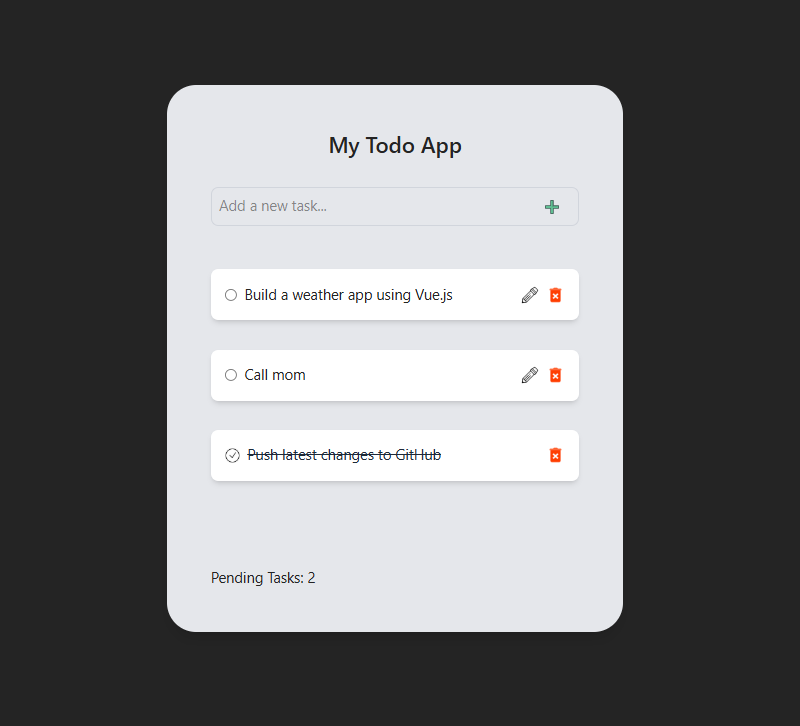

# My Todo App 📝

This is a simple and functional Todo App built with Vue.js 3. It allows users to add, edit, delete, and toggle the status of tasks. Tasks are persisted using the browser's `localStorage` so they remain even after refreshing the page.



---

## 🛠 Built With

-   [Vue.js 3](https://vuejs.org/)
-   [Tailwind CSS](https://tailwindcss.com/)
-   LocalStorage API

---

## 🚀 Getting Started

1. **Clone the repository:**

    ```sh
    git clone git@github.com:HeidiDragomir/todo-app-vuejs.git

    ```

2. **Navigate to the project folder:**

    ```sh
    cd todo-app-vuejs

    ```

3. **Install dependencies:**

    ```sh
    npm install

    ```

4. **Start the development server:**

    ```sh
    npm run dev

    ```

5. **Open in browser:**

    Visit [http://localhost:5173](http://localhost:5173) to view the app.

---
